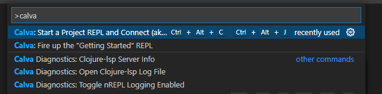
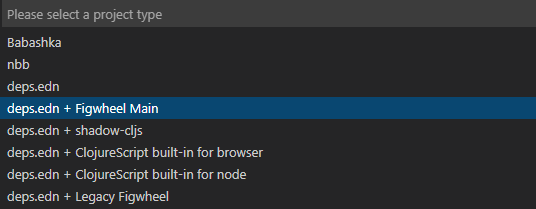
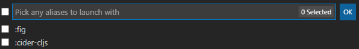
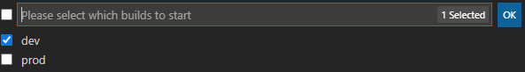
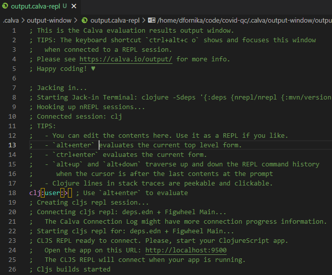
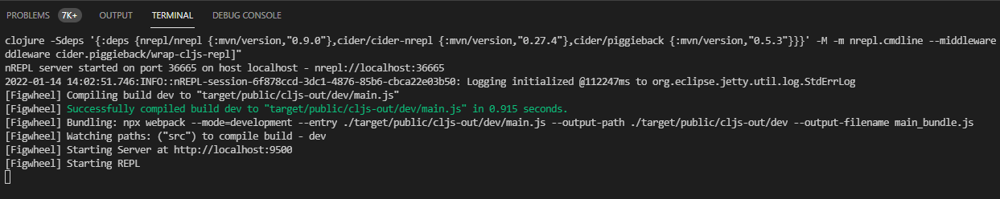

# Genomics QC Site Demo

This site is a demonstration of a design for review of genomics quality control data.

## Development Setup

This site is written in [ClojureScript](https://clojurescript.org/), a dialect of [Clojure](https://clojure.org/) that compiles down to JavaScript.  

### Prerequisites - JDK, Clojure & NPM
The ClojureScript compiler requires JDK 8 or later. Follow [this guide](https://clojure.org/guides/getting_started) to installing clojure on your platform before starting development on this site.

The 'Node Package Manager' ([NPM](https://www.npmjs.com/)) is required for installing JavaScript dependencies. Follow [this guide](https://docs.npmjs.com/downloading-and-installing-node-js-and-npm) to install NPM on your platform.

After cloning this repository, run `npm install` from the top-level of the repo to install the JavaScript dependencies into the `node_modules` directory.

### Generate demo data
A helper script is provided for generating datasets to use with the site. Run:

```
./scripts/generate_demo_data.sh
```

### VS Code - Calva
[Calva](https://calva.io/) is a clojure(script) development environment for [VS Code](https://code.visualstudio.com/). Search for `calva` in the VS Code Extensions marketplace to install it.

Open the `covid-qc` folder in VS Code. Open the VS Code Command Palette (`Ctrl-Shift-P`), and search for `calva`:



Select "Calva: Start a Project REPL and Connect".

When prompted for a project type, select 'deps.edn + Figwheel Main':



When prompted to select aliases, make sure that no aliases are selected, and click 'OK':



When prompted to select builds, select 'dev' and click 'OK':



A calva evaluation results output window should appear:



...and there should be messages printed to the terminal showing that the site has been compiled and served at http://localhost:9500


